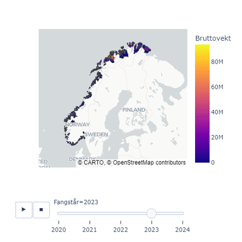

# Fiskeridirektoratet

## R - sf: Tidsserie av torsk fisket utenfor norskekysten.


Denne animasjon viser "hot spots" for kommersielt fiske etter torsk langs norskekysten. Tidsserie fra 2011-2024 i et heatmap plot. Data hentet fra ERS rapporter fra fiskeridirektorates åpne data. Ikke delt kode til dette prosjktet enda.

## Python - plotly: Tidsserie for bruttovekt torsk levert til kommuner i norge


Denne animasjon viser et interaktivt koroplettkart laget med plotly pakkene i python. Det viser distribusjon av bruttovekt torsk levert til norske kommuner av kommersielle fiskebåter over 50 fot fra 2020-2024. 
Data hentet fra ERS rapporter fra fiskeridirektorates åpne data.

## Eksempel kode: Python - plotly: Tidsserie for bruttovekt torsk levert til kommuner i norge
### Libraries

```

#Libraries
import ast
import pandas as pd
import geopandas as gpd
import numpy as np
import json
import requests

import plotly
import plotly.express as px
import matplotlib.pyplot as plt
import matplotlib.dates as mdates
from matplotlib import animation
from matplotlib.widgets import CheckButtons, Slider
from matplotlib.collections import LineCollection
from matplotlib.colors import ListedColormap, BoundaryNorm

from scipy import interpolate

# %matplotlib tk

```
### Fangstdata
fangstdata hentet fra fiskeridirektoratets [Åpne data: fangstdata (seddel) koblet med fartøydata](https://www.fiskeridir.no/Tall-og-analyse/AApne-data/Fangstdata-seddel-koblet-med-fartoeydata)

```
df_24 = pd.read_csv('fangstdata_2024.csv.zip', sep=';')
df_23 = pd.read_csv('fangstdata_2023.csv.zip', sep=';')
df_22 = pd.read_csv('fangstdata_2022.csv.zip', sep=';')
df_21 = pd.read_csv('fangstdata_2021.csv.zip', sep=';')
df_20 = pd.read_csv('fangstdata_2020.csv.zip', sep=';')

```

### Merge data
Sett sammen datasettene fra valgt år til ett datasett

```
df_merge = pd.concat([df_20, df_21, df_22, df_23, df_24], ignore_index=True)
del [df_20, df_21, df_22, df_23, df_24] # delete unused datasets
```

### Reduser datasettet til ønsket variabler og formater datatyper

```
df = df_merge[['Landingskommune', 'Fartøynavn', 'Lengdegruppe', 'Største lengde', 'Fangstår', 'Redskap - hovedgruppe', 'Art FAO', 'Anvendelse', 'Bruttovekt', 'Produktvekt']]

# Set datatypes and format data
df = df[['Landingskommune', 'Fangstår', 'Lengdegruppe', 'Art FAO', 'Anvendelse', 'Bruttovekt']]
dtypes = {
    "Landingskommune": "category",
    "Lengdegruppe": "category",
    "Art FAO": "category",
    "Anvendelse": "category"}
df = df.astype(dtypes)
df.dtypes

df['Bruttovekt'] = df['Bruttovekt'].str.replace(',','.')
df['Bruttovekt'] = pd.to_numeric(df['Bruttovekt'])
df['Fangstår'] = pd.to_numeric(df['Fangstår'])
df['Landingskommune'] = df['Landingskommune'].str.capitalize()
```

### Last inn geojson fil med kommune data

```
with open('Kommuner-L.geojson', encoding='utf-8') as fh:
    GEO = json.load(fh)
# GEO["features"][0]


gdf = gpd.GeoDataFrame.from_features(GEO,  crs='epsg:4326')
# gdf.crs
```

### Plot torsk bruttovekt 2020-2024

Reduser datasettet til torsk
```
df_cod = df[df["Art FAO"] == "Torsk"]
```
Summer all torsk tatt inn til hver kommune hvert år

```
n_cod = df_cod.groupby(["Landingskommune", "Fangstår"])["Bruttovekt"].sum()

n_cod.head(10)
df_cod_plot = n_cod.to_frame().reset_index()
```
Plot data

```
fig = px.choropleth_map(df_cod_plot, geojson=gdf, color="Bruttovekt",
                           locations="Landingskommune", featureidkey="properties.name",
                           animation_frame = "Fangstår",
                           range_color=(min(df_cod_plot.Bruttovekt), max(df_cod_plot.Bruttovekt)),
                           center={"lat": 64, "lon": 12},
                           map_style="carto-positron", zoom=3)
# fig.update_layout(margin={"r":0,"t":0,"l":0,"b":0})
fig.update_layout(height=500,width=500)

fig.show()

# plotly.offline.plot(fig, filename='Cod_bruttovekt.html')
```


