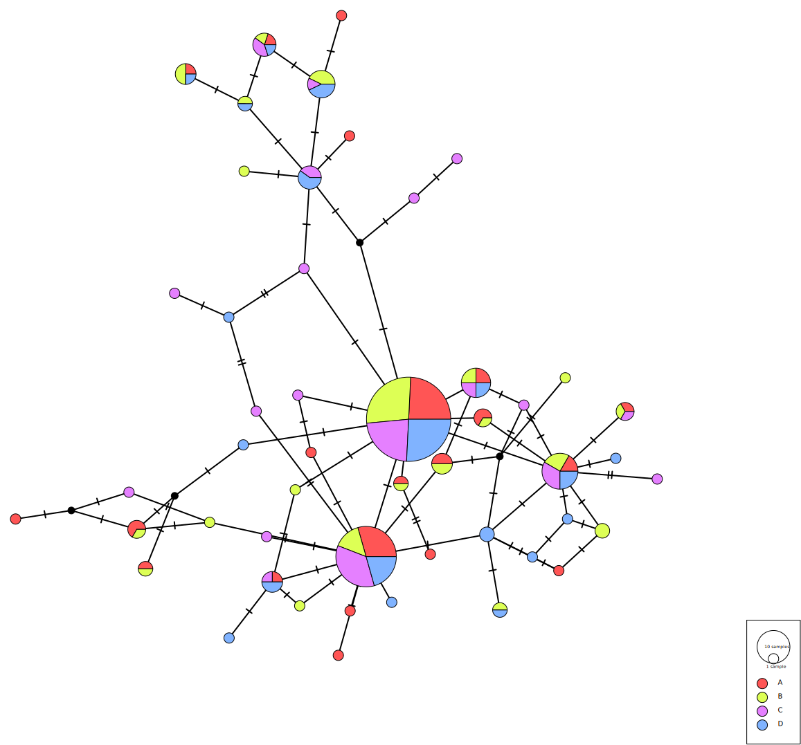

####PopART

[manual](http://popart.otago.ac.nz/doc/popart.pdf)

PopART imports nexus files and needs traits to be set for populations. 

With the MEGA software you can export the multifasta files to nexus files

The first part of the nexus file contains information about the species and includes a matrix of the variant sequences.
```
#NEXUS
[ Title COI]
begin taxa;
   dimensions ntax= 200;
   taxlabels
    Orchomenella_obtusa_A1 
      Orchomenella_obtusa_A2
      ...
      ...
            Orchomenella_obtusa_D9 
;
end;
begin characters;
   dimensions nchar= 47;
   format missing=? gap=- matchchar=. datatype=nucleotide;
   matrix

[!Domain=Data;]
Orchomenella_obtusa_A1 
TCCAGGTGCGTAATTAAGTTTTATTCACTATGGAAGTCCGATTCCTG
Orchomenella_obtusa_A10
.............C..............C...A.............C
...
...
Orchomenella_obtusa_D9 
...............G.........T......A.....T.......C
;
end;
```

The second part of the nexus file has to be added manually for PopART, this includes the population or site information and is stored as traits.

NTRAITS sets how many traits are inculded, TraitLabels sets the name of the traits and the matrix contains information from where are the traits found. e.g Orchomenella_obtusa_A1  is contained in trait A (1,0,0,0 ), Orchomenella_obtusa_C3 is contained in trait C (0,0,1,0).
```
BEGIN TRAITS;
Dimensions NTRAITS=4;
Format labels=yes missing=? separator=Comma;
TraitLabels A B C D;
Matrix
  Orchomenella_obtusa_A1  1,0,0,0
  Orchomenella_obtusa_A10 1,0,0,0
  ..
  ..
  Orchomenella_obtusa_D8  0,0,0,1
  Orchomenella_obtusa_D9  0,0,0,1
;
End;
```

The file can then be imported into PopART and a haplotype network tree can then be created.

Here is a median-joining haplotype network for COI

