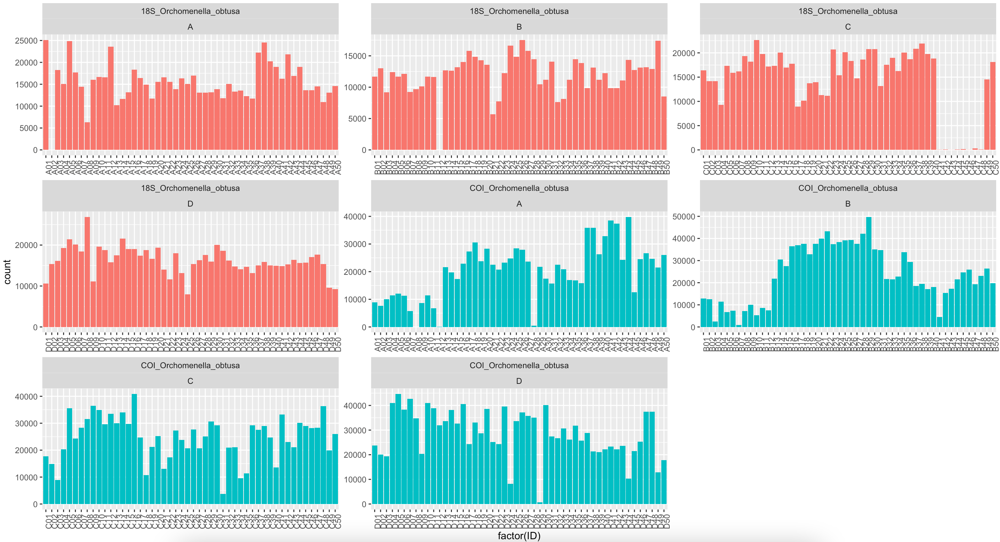

## About the data

This report explores the population structure and connectivity of the mesopelagic savaging amphipod Orchomenella obtusa between two connecting fjord systems (Saltenfjorden, Skjerstadfjorden). The fjord system is connected through Saltstraumen, a 40m deep sill where tidal forces transfer large water masses between the two fjords. O. obtusa were sampled at four equidistant locations with two stations per fjord. 50 individuals from each station were sequenced on Illumina MiSeq for amplicons of mtDNA COI and 18S rRNA.


## Programs used

FastQC    [Program](https://www.bioinformatics.babraham.ac.uk/projects/download.html#fastqc) - [Manual](https://www.bioinformatics.babraham.ac.uk/projects/fastqc/Help/)<br/>
MultiQC   [Program](https://multiqc.info/) - [Manual](https://multiqc.info/docs/)<br/>
cutadapt  [Program](https://bioconda.github.io/recipes/cutadapt/README.html) - [Manual](https://cutadapt.readthedocs.io/en/stable/guide.html)<br/>
bowtie2   [Program](https://sourceforge.net/projects/bowtie-bio/files/bowtie2/) - [Manual](http://bowtie-bio.sourceforge.net/bowtie2/manual.shtml)<br/>
BCFtools  [Program](http://www.htslib.org/download/) - [Manual](https://samtools.github.io/bcftools/bcftools.html)


## Trimming and Quality Control

### Rename sequence file names for easier parsing in later steps

Keep individual ID and strand direction, discard sequence ID and direction ID

```
id_loc="/Users/hetzler/Amphipod/MiSeq/fastQ/"

cd $id_loc

a="$(ls *.fastq)"

for i in $a
do
	b="$(echo $i | perl -pe 's/(\S)_S[0-9]+(\S)/$1$2/')"
	
	mv $i $b
done
```

### Trim adapters with cutadapt

Trim amplicon adapters from the fastq files, this removes any possibilities for point mutations from degenerated PCR primers to be included in the further analysis of the data. 

Trim COI and 18S primers from one fastq file.

```
#Activate Conda environment before running: conda activate cutadaptenv

cutadapt \
-g CHACWAAYCATAAAGATATYGG \
-g ATCCCTGGTTGATCCTGCCAGT \
-G AWACTTCVGGRTGVCCAAARAATCA \
-G CCTGCGCTCGATACTGACAT \
-o trmFastQ/A1_R1.fastq.gz -p trmFastQ/A1_R2.fastq.gz \
--discard-untrimmed A1_S218_L001_R1_001.fastq.gz A1_S218_L001_R2_001.fastq.gz
```

Trim COI and 18S primers from multiple fastq files.


```
#Activate Conda environment before running: conda activate cutadaptenv


inp_loc="/Users/hetzler/Amphipod/MiSeq/fastq"
out_loc="/Users/hetzler/Amphipod/MiSeq/trimmed"
cd $inp_loc

#trim adaptor for all fastq files
for i in $(eval echo {A..D}); do
  for x in {1..5}; do
      FWD1=CHACWAAYCATAAAGATATYGG  #forward primer COI
      FWD2=ATCCCTGGTTGATCCTGCCAGT  #forward primer 18S
      REV1=AWACTTCVGGRTGVCCAAARAATCA #reverse primer COI
      REV2=CCTGCGCTCGATACTGACAT  #reverse primer 18S
      cutadapt -g $FWD1 -g $FWD2 -G $REV1 -G $REV2 \
      -o $out_loc/${i}${x}\_R1.fastq -p $out_loc/${i}${x}\_R2.fastq \
      ${i}${x}\_L001_R2_001.fastq \
      ${i}${x}\_L001_R1_001.fastq
    done
done
```

Read counts for all samples:


```
 echo $(zcat *.fastq.gz|wc -l)/4|bc
````

All reads are kept after trimming for amplicon adater <br/>
Before: 9820292 reads <br/>
After: 9820292 reads 

### create fastQC reports for multiQC

```
set_loc="/Users/hetzler/Amphipod/MiSeq/trmFastQ"

cd $set_loc

find . -name "*.fastq" | xargs fastqc 

multiqc .
```

Original data<br/>
[MultiQC orignal data](multiqc_report.html)

Adapter trimmed<br/>
[MultiQC trimmed data](multiqc_report_trm.html)

## Sequence mapping

The amplicon sequences are mapped to their reference genes using the bowtie2 alignment tool.<br/>
Reference genes used in this analysis were exracted a denovo assembly of Orchomenella obtusa from a WGS run for the [High throughput sequencing of non-model organisms](https://www.nord.no/no/aktuelt/kalender/Sider/PhD-course-High-throughput-sequencing-of-non-model-organisms-DR425F-2017.aspx) course at Nord university.

### Create reference sequence index
Create index reference files for bowtie2 alignment.

[reference.fasta](reference.fasta) contains COI and 18S reference sequence. 

```
bowtie2-build "/Users/hetzler/Amphipod/referenceSeq/reference.fasta" "/Users/hetzler/Amphipod/referenceSeq/reference"
```

### Map reads to reference sequence

Map reads to reference sequence using bowtie2. 


```
inp_loc="/Users/hetzler/Amphipod/MiSeq/trimmed"
out_loc="/Users/hetzler/Amphipod/mappedReads"

#map to reference
for i in $(eval echo {A..D}); do
  for x in {1..50}
    do
      bowtie2 --end-to-end -N 0 -L 20 --dpad 15 --gbar 4 --seed 0 --threads 1 -q \
      --rg-id ${i}${x} \
      -x "/Users/hetzler/Amphipod/referenceSeq_test/reference" \
      -U $inp_loc/${i}${x}\_R1.fastq,$inp_loc/${i}${x}\_R2.fastq \
      -S $out_loc/${i}${x}.sam
    done
done
```

[How to manipulate sam/bam files](https://medium.com/@shilparaopradeep/samtools-guide-learning-how-to-filter-and-manipulate-with-sam-bam-files-2c28b25d29e8)

Remove low quality mapped reads

```
inp_loc="/home/jhetzler/MiSeqOSL/map"
out_loc="/home/jhetzler/MiSeqOSL/map/fltr"

for i in $(eval echo {A..D}); do
  for x in {1..50}
    do
      samtools view -q 30 -b $inp_loc/${i}${x}.bam > $out_loc/${i}${x}.bam
    done
```
```
library(ggplot2)

counts <- read.delim("~/Amphipod/MiSeqOSL/R/counts.txt", header=FALSE)

colnames(counts) <- c("gene", "count", "ID", "site")


ggplot(counts, aes(factor(ID), count, fill = gene)) +     
  geom_col(position = 'dodge') +
  theme(axis.text.x = element_text(angle = 90), legend.position = "none") +
  facet_wrap(~as.factor(counts$gene) + as.factor(counts$site), scales = "free")
```


*figure 1: 7 individuals with <100 mapped reads, mean read count 18S: 14469, mean read count COI: 24376. with group mean varying between 11979 (18S site A) to 28786 (COI site D)*

### Sort and convert from .sam to .bam

Before running any variant calling software we pre-sort the bam files.

```
set_loc="/Users/hetzler/Amphipod/mappedReads"

cd $set_loc

# samtools:  sort .sam file and convert to .bam file
for i in $(eval echo {A..D}); do
	for x in {1..5}; do
    samtools view -bS ${i}${x}.sam | samtools sort - -o sort_${i}${x}.bam
  done
done
```

## variant calling

With bcftools we identify variants from the sequence data, for our analysis we are after Single Nucleotide Variant (SNV). Other types of variants called by the software include MNP (adjacent SNPs) and indels, these are not included in further analysis.

Note: The newer version of BCFtools [mpileup] sets maximum number of reads per input file set to -d 250, this can be set higher to include more reads. Previous limit was set to 8000.

```
ref_file="/Users/hetzler/Amphipod/referenceSeq/reference.fasta"
id_loc="/Users/hetzler/Amphipod/mappedReads"
out_loc="/Users/hetzler/Amphipod/variantCalling"
cd $id_loc

#variant calling
for i in $(eval echo {A..D}); do
	for x in {1..5}; do
    bcftools mpileup -f $ref_file sort_${i}${x}.bam | bcftools call -mv -Ob -o $out_loc/calls_${i}${x}.vcf.gz
  done
done
```

Create variant calling index file. 

```
set_loc="/Users/hetzler/Amphipod/variantCalling"

cd $set_loc

#index vcf
for i in $(eval echo {A..D}); do
  for x in {1..5}; do
   bcftools index calls_${i}${x}.vcf.gz
    done
done
```

Merge indipendent variant calling files into one files, containing only shared variants accross individuals.

!Should I merge by sample site instead of all, to get a better resolution into the data?

```
set_loc="/Users/hetzler/Amphipod/variantCalling"

cd $set_loc

ls calls_*.vcf.gz > merge.txt

bcftools merge -l merge.txt -0 -Oz -o pop.vcf.gz

bcftools merge -m indels -l merge.txt -0 -Oz -o indel.vcf.gz

bcftools annotate -x INFO,^FORMAT/GT pop.vcf.gz -Oz -o popAno.vcf.gz
```

54 SNPs (7 from multiallelic sites) and 1 indel were retrived from filtered sequences with bcftools. 

```
bcftools view file.vcf.gz --regions [CHROM NAME] > output.vcf 

bgzip output.vcf
```

#### MAF filtering

Threshold for MAF filtering is normally set to 0.05, with this threshold we would loose to much information to do any further analysis so a lower threshold is chosen at 0.01.

```
bcftools view -q 0.01:minor pop.vcf.gz > popMAF_01.vcf.gz
```

After filtering for minor allele frequency (MAF) we are left with 24 SNPs (4 from multialleleic sites)

We split the data into seperate VCF files for each gene to do further analysis in R with the packages pegas, mmod and adegenet.

#### Multifasta from consensus files.

[Samtools consensus sequence manual](https://samtools.github.io/bcftools/howtos/consensus-sequence.html)

with the retrieved SNV we can create a consensus sequence 
Create consensus files from reference fasta and indexed VCF file using only SNPs

```
#!/bin/bash
set_loc="/home/jhetzler/MiSeqOSL/VC"

cd $set_loc

for i in $(eval echo {A..D}); do
  for x in {1..50}; do
cat /home/jhetzler/MiSeqOSL/ref/reference.fasta | \
bcftools consensus -i 'TYPE="snp"' -s ${i}${x}.bam ${i}${x}.vcf.gz > multi/${i}${x}.fa
  done
done
```

Add prefix of fasta headers
```
#!/bin/bash
set_loc="/home/jhetzler/MiSeqOSL/VC/fltr"
cd $set_loc

for i in $(eval echo {A..D}); do
  for x in {1..50}; do
        perl -pi -e "s/^>/>${i}${x}_/g" multi/${i}${x}.fa
  done
done
```

Add suffix of fasta headers
```
#!/bin/bash
set_loc="/home/jhetzler/MiSeqOSL/VC/fltr"
cd $set_loc

for i in $(eval echo {A..D}); do
  for x in {1..50}; do
        perl -pi -e 's/^(>.*)$/$1-'$i''$x'/g' multi/${i}${x}.fa
  done
done
```

create multi.fasta file from fasta files
```
cat *.fa > multi.fas
```

separate multifasta files

```
#!/bin/bash

while read line ; do
  if [ ${line:0:1} == ">" ] ; then
    filename=$(echo "$line" | cut -d "_" -f1 | tr -d ">")
    touch ./"$filename".fasta
    echo "$line" >> ./"${filename}".fasta
  else
    echo "$line" >> ./"${filename}".fasta
  fi
done < $1
```

Create equal names between fasta headers:

```
#input file header: >18S_Orchomenella_obtusa_A1

sed 's/^>18S_/>/' < inputfile > outputfile

#output file header: Orchomenella_obtusa_A1
```

```
#input file header: >COI_Orchomenella_obtusa_A1

sed 's/^>COI_/>/' < inputfile > outputfile

#output file header: Orchomenella_obtusa_A1
```

In the MEGA software we can import the multifasta files and highlight variable sites and export the marked sites to a new fasta file, import the new fasta file again and highligth singleton sites and export to a final fasta file ready for differential analysis.

The output from MEGA should look something like:
```
#COI_var_st.fas
>Orchomenella_obtusa_A1  
TGTTATAGTTCTATGAATCCCG
>Orchomenella_obtusa_A10 
TGTTACAGTTCCATAAATCCCC
>Orchomenella_obtusa_A11 
TGTTATAGTTTTATAAATCTCC
>Orchomenella_obtusa_A12 
```

The reduced multifasta files containing only variable sites can be used to calculate [differential statistics](DiffSeq.md) and to create a haplotype network in [PopART](PopART.md) 
