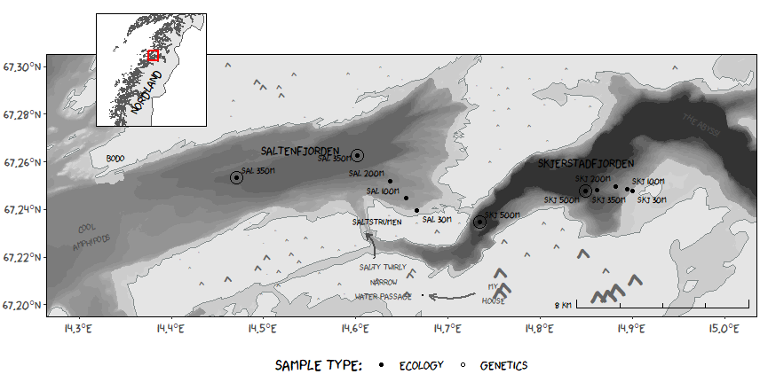

## xkcd sampling map - norwegian coast 

Sampling map for my master thesis in the style of Randall Munroe's [xkcd comic](https://xkcd.com/).

This map is made just for an excersise for myself in map making, and as a tribute to all the fantastic maps that Randall Munroe has made over the years.

### link to R file:
[xkcd map](xkcd_map.R)

### Data:

Depth of the sea is mapped using the nautical map with [depth data from kartkatalogen](https://kartkatalog.geonorge.no/metadata/sjoekart-dybdedata/2751aacf-5472-4850-a208-3532a51c529a),
the shoreline and inset map in created using data from the [Norwegian municipality map](https://github.com/robhop/fylker-og-kommuner/blob/main/Kommuner-L.geojson), 
Mountain tops created with data from the [N50 - kartdata from kartkatalogen](https://kartkatalog.geonorge.no/metadata/n50-kartdata/ea192681-d039-42ec-b1bc-f3ce04c189ac). 

Note: some data has to be downloaded for regions and not the whole of norway. if you are recreating this map with my data then depth data is for the whole of nordland, shore line is whole of norway and mountain tops for the municipality of Bodø.

### xkcd aesthetics:
This map plot would not have been possible for me to make without the [xkcd font](https://github.com/ipython/xkcd-font), and the R package from Emilio Torres-Manzanera, [xkcd: An R Package for Plotting XKCD Graphs](https://cran.r-project.org/web/packages/xkcd/vignettes/xkcd-intro.pdf), made it a lot easier to implement the xkcd font to the axis of the plot.

